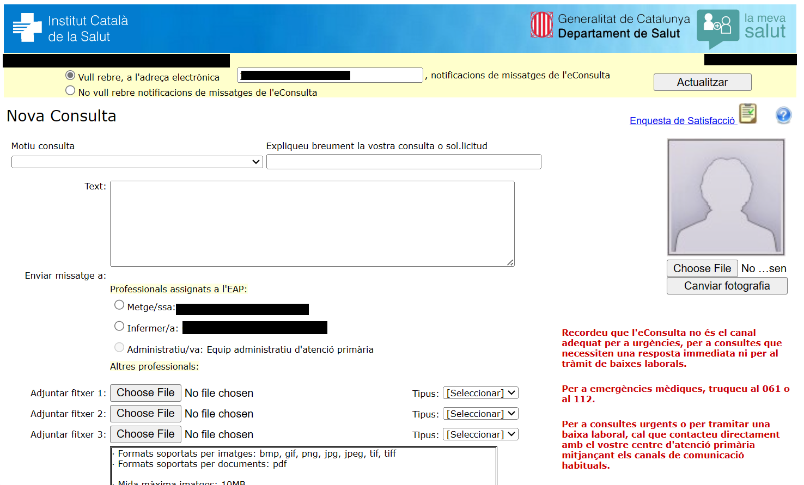
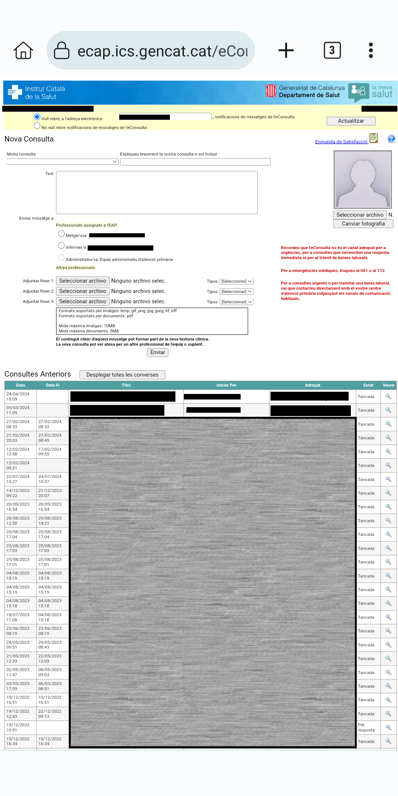
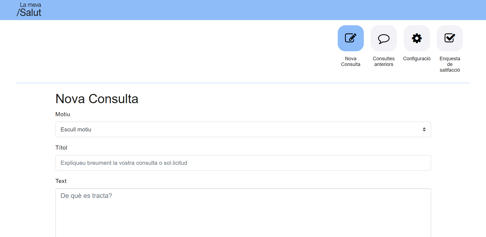
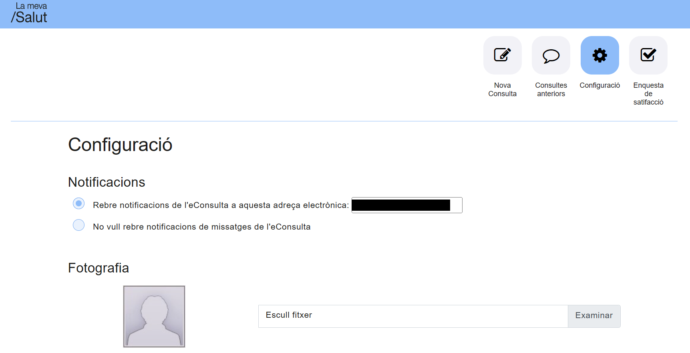
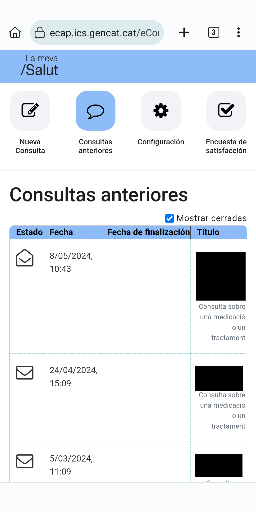
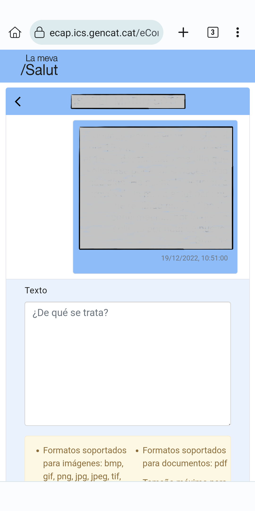
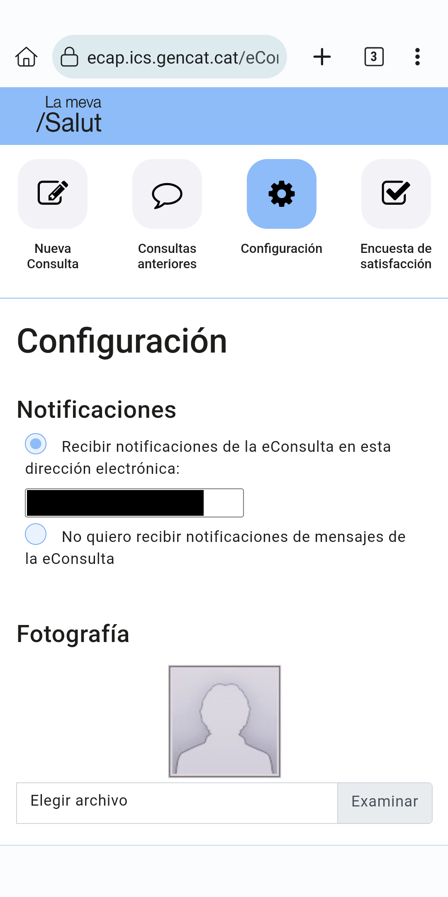
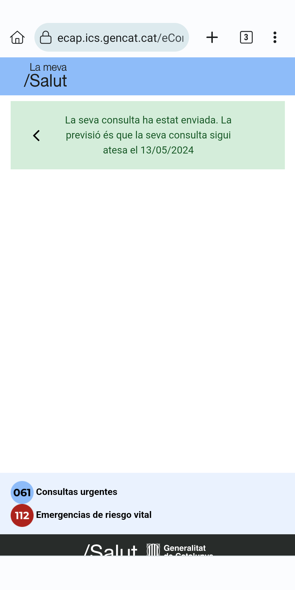

# Característiques

## Millora de l'aspecte

Sense La Meva Salut Plus, així es veu la eConsulta:

### Escriptori

### Dispositiu mòbil

Amb La Meva Salut Plus, es veu així:

### Escriptori

Nou missatge

Històric de xat

Xat

Configuració

<!-- TODO: Satisfaction does no longer exist -->

Enquesta de satisfacció

:::warning
Obselet
:::

### Dispositiu mòbil

Nou missatge

Històric de xat

Xat

Configuració

<!-- TODO: Satisfaction does no longer exist -->

Enquesta de satisfacció

:::warning
Obselet
:::

Missatget enviat crrectament

## Responsivitat

¡Ara eConsulta és realment usable des d'un dispositiu mòbil!

- Elements més grans que s'ajusten a la pantalla, sense necessitat d'apropar o allunyar.
- Separada en seccions per a una millor gestió.
- Més informació a la pantalla, incloent la visualització dels noms dels arxius adjunts.
- ¡No més actualitzacions forçades!

## Estils de La Meva Salut

Vaig intentar utilitzar, en primer lloc, els estils de La Meva Salut (utilitzant la seva full d'estils). Això dóna com a resultat una experiència més uniforme en general.

## Traduccions

eConsulta només està disponible en català, independentment de l'idioma que escullis a La Meva Salut. Ara està traduïda al castellà i el català s'ha reescrit una mica. L'anglès està disponible com a idioma de reserva.

La Meva Salut també està disponible en occità aranès, però La Meva Salut Plus no (encara)

Les traduccions de La Meva Salut Plus coincidiran amb les que hagis seleccionat a La Meva Salut. ¡Les pots canviar en directe!

::: warning
Pot haver-hi traduccions mancants, per exemple per a errors no controlats o contingut dinàmic, com notificacions. Poden aparèixer en anglès (per a errors catastròfics) o en català (per a missatges o errors controlats)
:::

## Vista de xat

¡Seguir una conversa amb el teu professional assignat ara és un xat de tota la vida!

## Mostrar o ocultar xats tancats

Pots escollir mostrar o ocultar els xats tancats. L'opció serà recordada.
