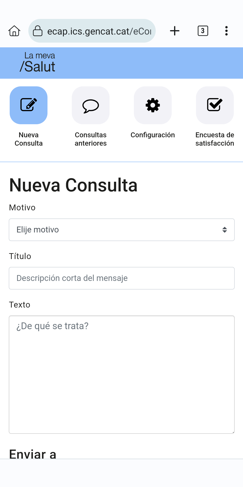

# Características

## Mejora del aspecto

Sin La Meva Salut Plus, así se ve la eConsulta:

### Escritorio

### Dispositivo móvil

Con La Meva Salut Plus, se ve así:

### Escritorio

Nuevo mensaje

Histórico de chat

Chat

Configuración

<!-- TODO: Satisfaction does no longer exist -->

Encuesta de satisfacción

:::warning
Obsoleto
:::

### Dispositivo móvil

Nuevo mensaje

Histórico de chat

Chat

Configuración

<!-- TODO: Satisfaction does no longer exist -->

Encuesta de satisfacción

:::warning
Obsoleto
:::

Mensaje enviado correctamente

## Responsividad

¡Ahora eConsulta es realmente usable desde un dispositivo móvil!

- Elementos más grandes que se ajustan a la pantalla, sin necesidad de acercar o alejar.
- Separado en secciones para un mejor manejo.
- Más información en pantalla, incluyendo la visualización de los nombres de los archivos adjuntos.
- ¡No más actualizaciones forzadas!

## Estilos de La Meva Salut

Intenté utilizar, en primer lugar, los estilos de La Meva Salut (utilizando su hoja de estilos). Esto da como resultado una experiencia más uniforme en general.

## Traducciones

eConsulta solo está disponible en catalán, independientemente del idioma que elijas en La Meva Salut. Ahora está traducido al español y el catalán se ha reescrito un poco. El inglés está disponible como idioma de respaldo.

La Meva Salut también está disponible en occitano aranés, pero La Meva Salut Plus no (todavía)

Las traducciones de La Meva Salut Plus coincidirán con las que hayas seleccionado en La Meva Salut. ¡Puedes cambiarlas en vivo!

::: warning
Puede haber traducciones faltantes, por ejemplo para errores no controlados o contenido dinámico, como notificaciones. Pueden aparecer en inglés (para errores catastróficos) o en catalán (para mensajes o errores controlados)
:::

## Vista de chat

¡Seguir una conversación con tu profesional asignado ahora es un chat de toda la vida!

## Mostrar u ocultar chats cerrados

Puedes elegir mostrar u ocultar los chats cerrados. La opción será recordada.