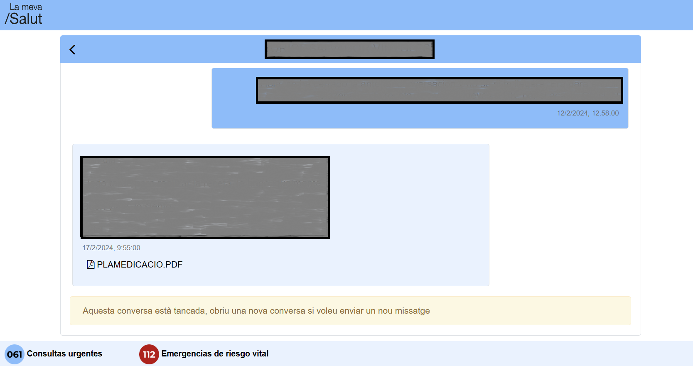
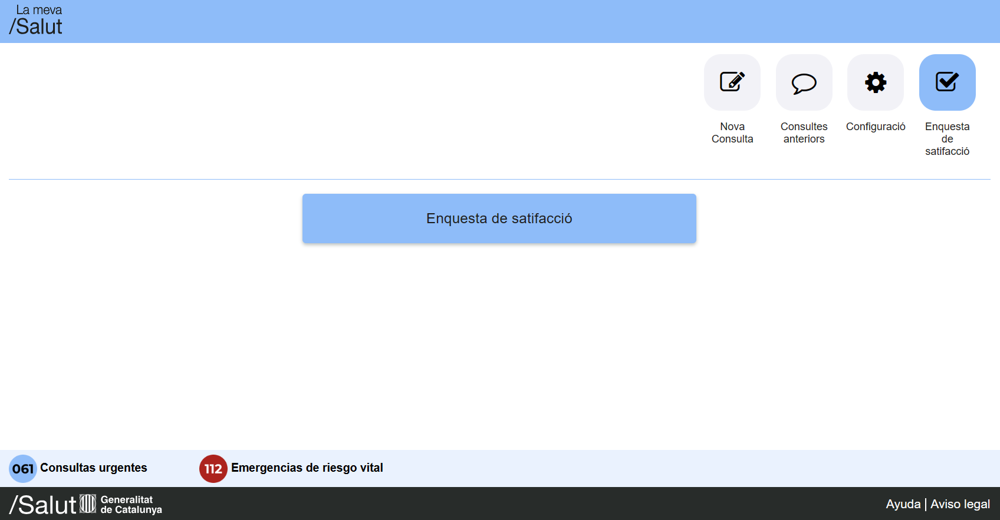

# Características

## Mejora del aspecto

Sin La Meva Salut Plus, así se ve la eConsulta:

### Escritorio

### Dispositivo móvil

Con La Meva Salut Plus, se ve así:

### Escritorio

Nuevo mensaje

Histórico de chat

Chat

Configuración

<!-- TODO: Satisfaction does no longer exist -->

Encuesta de satisfacción

### Dispositivo móvil

Nuevo mensaje

Histórico de chat

Chat

Configuración

<!-- TODO: Satisfaction does no longer exist -->

Encuesta de satifacción

Mensaje enviado correctamente

## Responsiveness

¡Ahora la eConsulta se puede usar desde un dispoisitivo móvil!

- Elementos más grandes que se adaptan a la pantalla, sin necesidad de hacer zoom.
- Separación en secciones para eliminar elementos no usados de la pantalla.
- Más información en la pantalla, incluído mostrar los nombres de los archivos para los adjuntos.
- ¡Se acabaron los refrescos de pantalla constantes!

## Estilos de La Meva Salut

He intentado usar, a primeras, los estilos de La Meva Salut (usando sus hojas de estilo), dando una experiencia más uniforme.

## Traducciones

eConsulta solo está disponible en catalán, sin importar el lenguaje que hayas elegido en La Meva Salut. Ahora está traducido al español y el catalán ha sido corregido donde ha sido necesario. Inglés está disponible como último recurso.

La Meva Salut está disponible en occitan aranés, pero La Meva Salut Plus no (todavía).

El lenguaje en La Meva Salut Plus es el mismo que el de La Meva Salut, ¡se puede actualizar en vivo! 

::: warning
Pueden faltar algunas traducciones, como por ejemplo errores no controlados o contenido dinámico, como las notificaciones. Pueden aparecer tanto en inglés (errores catastróficos) o catalán (mensajes o errores controlados)
:::

## Vista de chat

¡La conversación con tu profesional asignado ahora parece un chat de toda la vida!

## Mostrar u ocultar chats cerrados

Puedes mostrar y ocultar los chats cerrados. La opción será recordada para la próxima vez.
