# Features

## Improved look and feel

Without La Meva Salut Plus, eConsulta looks like this:

### Desktop

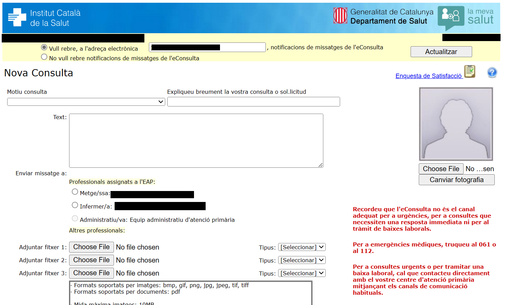

### Mobile

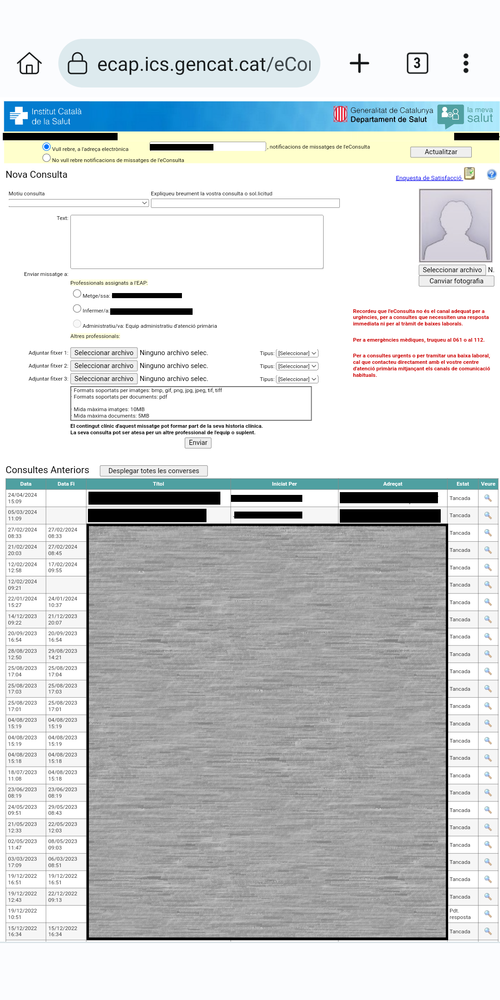

With La Meva Salut Plus, it looks like this:

### Desktop

New message

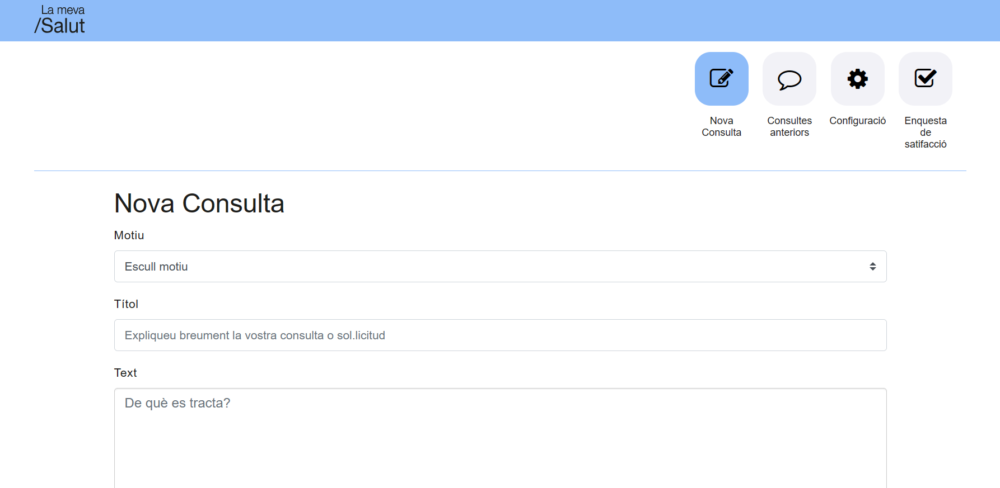

Chat history

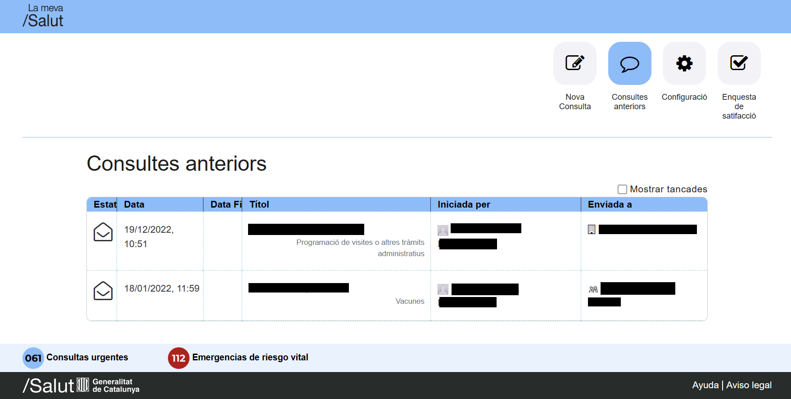

Chat

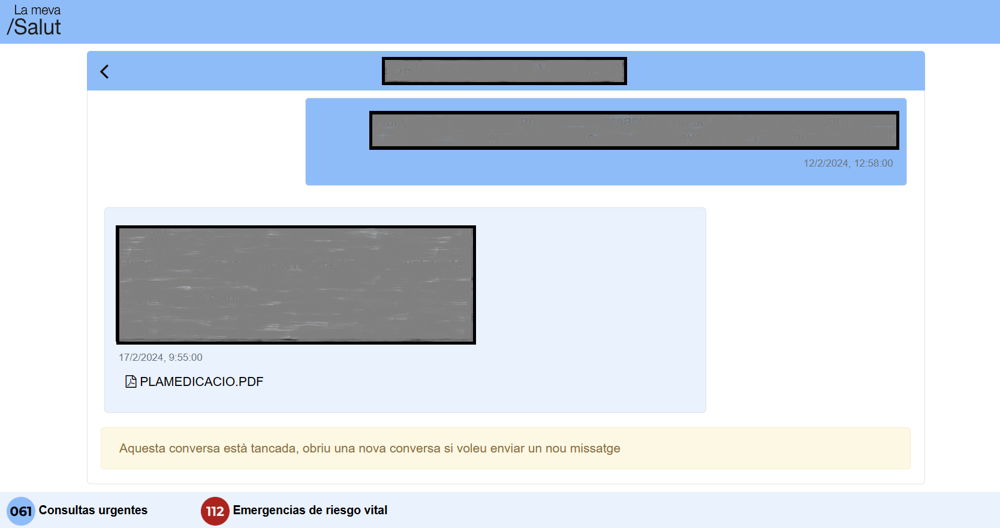

Settings

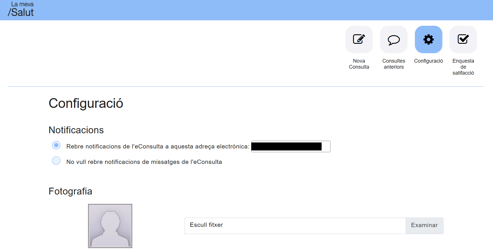

Satisfaction poll

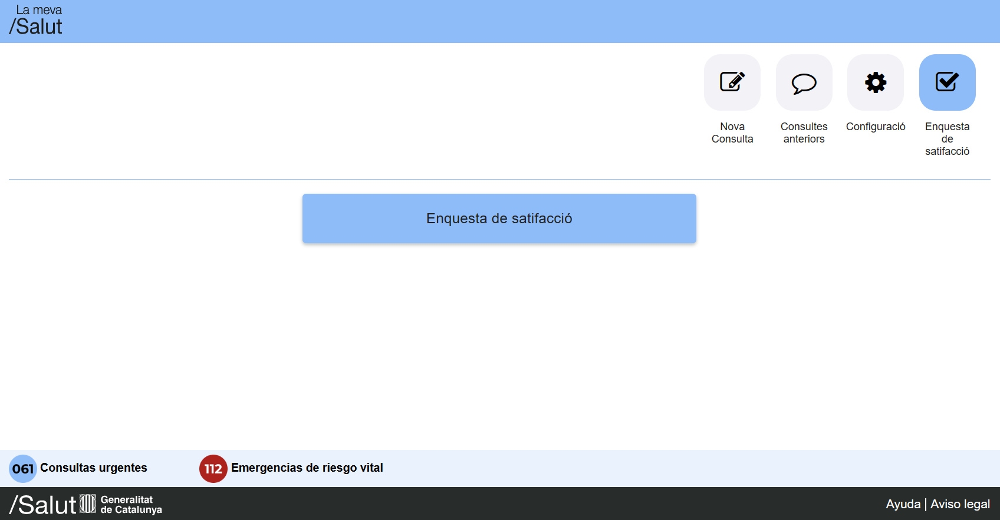

### Mobile

New message

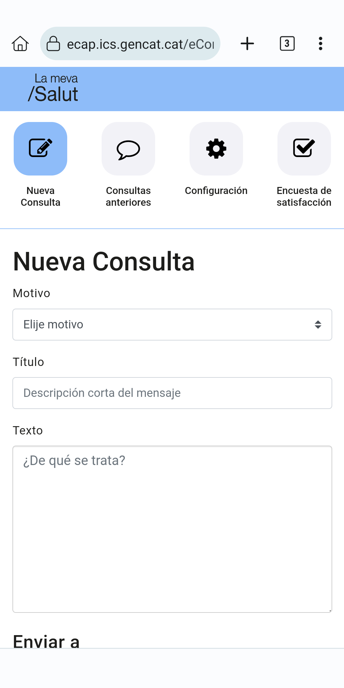

Chat history

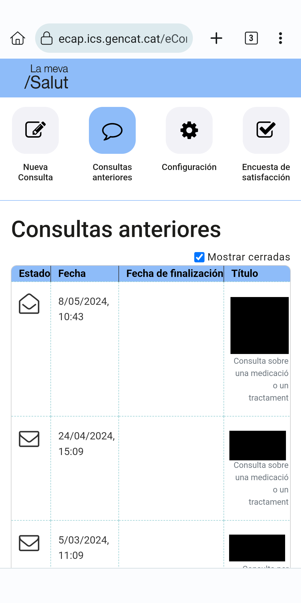

Chat

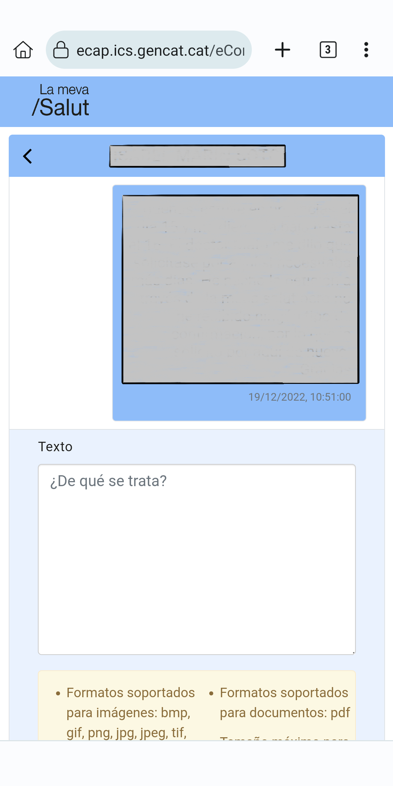

Settings

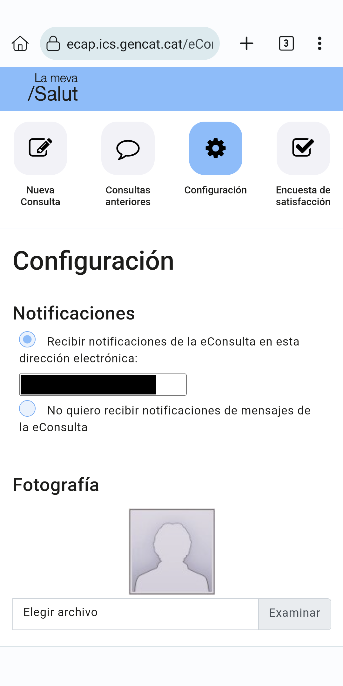

Satisfaction poll

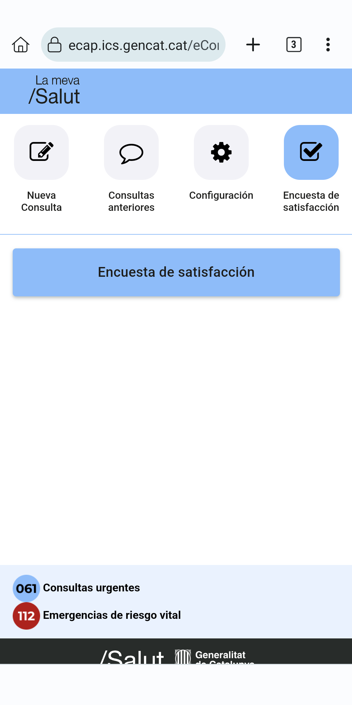

Message sent successfully

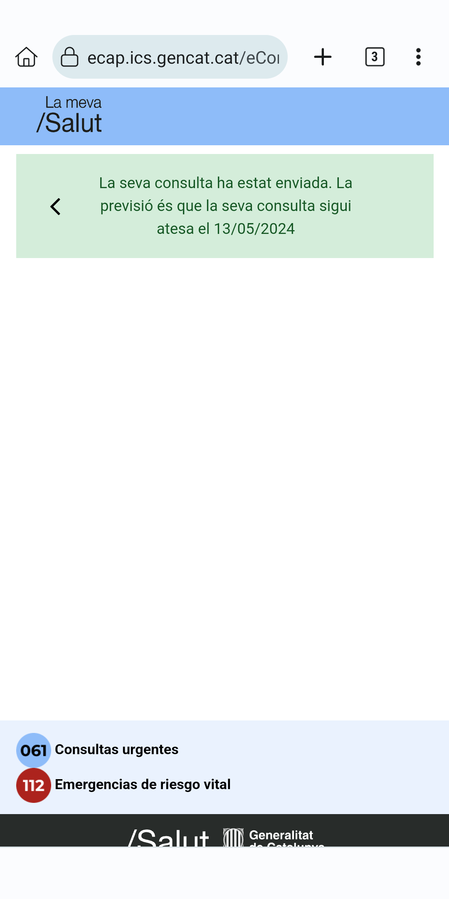

## Responsiveness

Now the eConsulta is actually usable from a mobile device!

- Larger elements that fit the screen, no need to zoom in and out.
- Separated in sections for better handling.
- More information on screen, including showing the file names from the attachments.
- No more forced refresh!

## La Meva Salut styles

I tried to use, firstly, La Meva Salut styles (using their style sheet). This results in a more uniform experience overall.

## Translations

eConsulta is only available in Catalan, no matter what language you chose in La Meva Salut. Now it's translated to Spanish and Catalan has been rewritten a bit. English is available as a fallback language.

La Meva Salut is also available in Occitan aranés, but La Meva Salut Plus is not (yet!)

La Meva Salut Plus translations will match the one you have selected in La Meva Salut. You can change it live!

::: warning
There may be missing translations, for example for uncontrolled errors or dynamic content, such as notifications. They may appear in both English (for catastrophic failures) or Catalan (for messages or controlled errors)
:::

## Chat view

Following a conversation with your assigned professional now looks like a good old chat!

## Show or hide closed chats

You can choose to show or hide the closed chats. The option will be remembered.

